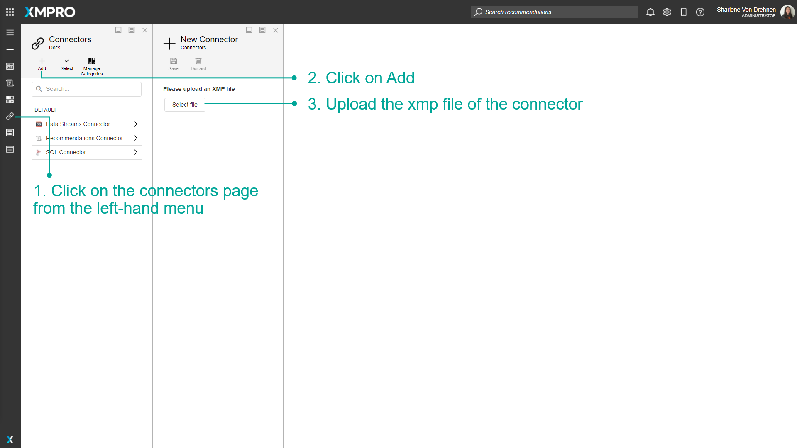
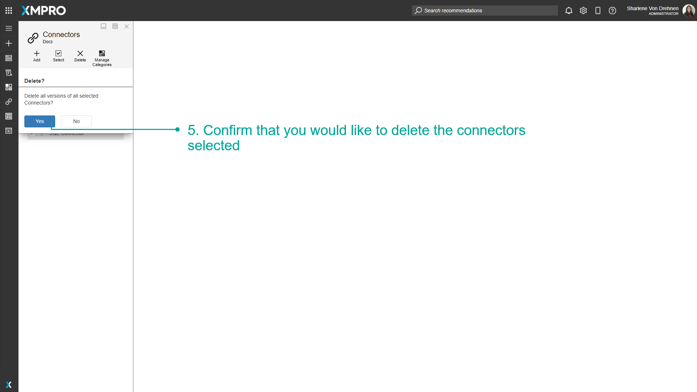
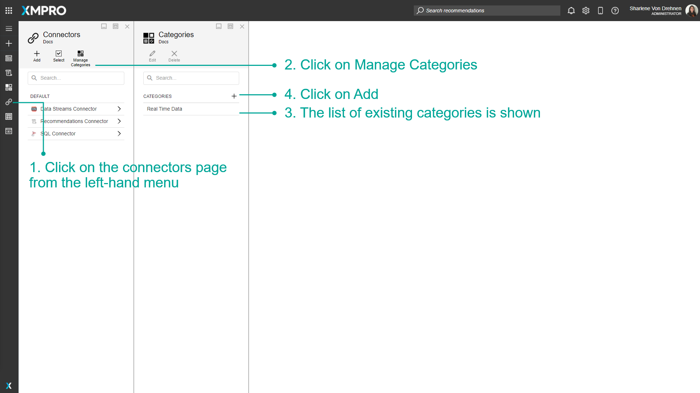
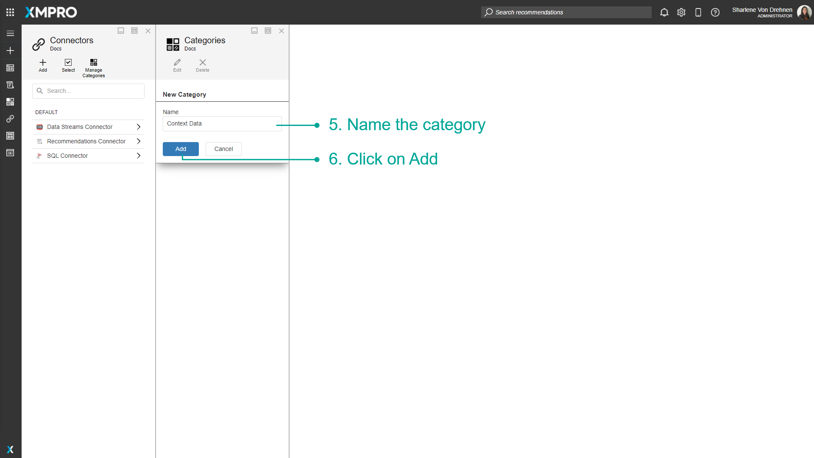

# Manage Connectors

Connectors allow you to connect to third-party sources of data. Examples of these Data Sources include databases, Data Streams, or Recommendations, which can be integrated into the Application and are needed if you want to display any real-time or context data to the user on a Page of an Application.


It is recommended that you read the article listed below to improve your understanding of Connectors.

* [Connector](../../concepts/connector.md)


## **Creating Connectors**

Creating a Connector can be divided into two parts:

### Writing the code for a Connector

Connectors are generally written in C# as library projects that make use of the [XMPro.IoT.Framework](https://www.nuget.org/packages/XMPro.IOT.Framework/) NuGet package.

XMPro.IoT.Framework requires your project to be written using a predefined structure. This structure requires you to implement certain interfaces.&#x20;

To learn more about how to use this framework, refer to [these](building-connectors.md) instructions.


Code for some Connectors has been made available on [GitHub.](https://github.com/XMPro/) It might be useful to use these resources as an example when writing your own Connectors.


### Packaging the Connector

After writing your code, you need to use the [XMPro Package Manager](https://apps.microsoft.com/store/detail/xmpro-package-manager/9N3F4WNSLGZK?hl=en-us\&gl=us\&activetab=pivot%3Aoverviewtab) Windows 10 desktop application to package your Connector.&#x20;

This application allows you to specify all the properties your Connector requires, add the user settings in the form of controls, and allows you to upload the DLL of the Connector you’ve written. Finally, it will create a file with a “.xmp” extension, which you can upload to App Designer and start to use to build Applications.&#x20;

To package the Connector, refer to [these](packaging-connectors.md) instructions.

## Adding a Connector

Connectors can be added via the Connectors page before being used in any of the Applications.

1. Click on the _Connectors_ page from the left-hand menu.
2. Click on _Add_.
3. Upload the _xmp file_ of the Connector.
4. The unique ID, name, version, and description are re-filled based on details from the file uploaded.
5. Add the category.
6. Click on _Save_.

.png>)

Selecting an existing Connector opens the configuration panel where details for the Connector can be viewed. The category can also be changed here.

.png>)

## Deleting Connectors

Connectors can be removed via the Connectors page. To remove Connectors:

1. Open the _Connectors_ page from the left-hand menu.
2. Click _Select_.
3. Select the Connectors that you would like to remove.
4. Click _Delete_.

.png>)

&#x20;   5\. Confirm that you would like to delete the Connectors selected.

## Versions of a Connector

When a new [version](../../concepts/version.md) of a Connector is added, the Connector will be updated to the new version. The old version will remain and Applications using the old version of the Connector will continue to use that version until it is upgraded manually.&#x20;

1. Open the Connectors page from the left-hand menu.
2. Select a Connector to view its information.
3. Each version is shown along with the number of Applications still using that version.&#x20;
4. Select the version to view the complete list of Applications still using that version.


Users with [DeleteConnector](../../administration/subscriptions-admin/manage-user-access.md#app-designer-rights-and-roles) rights and Admins see the usage count for all Applications, whereas other users see the usage count of Applications to which they have access.


.png>)

## Categories

Connectors can be organized into categories. These categories are separate from the [App and Data Stream Categories](../../concepts/category.md).

1. Click on the Connectors page from the left-hand menu.
2. Click on Manage Categories.
3. The list of existing categories is shown.
4. Click on Add.

&#x20;   5\. Name the category.\
&#x20;   6\. Click on Add.

Categories for Connectors can also be edited or removed. To edit or remove a category for Connectors, select the category from the list of existing categories to enable the edit and remove options.

## Finding Help for Connectors

Help documentation is available for every Connector. These pages provide context, configuration definitions, an example, and release notes to help if you are unsure of anything related to the Connector you are configuring.&#x20;

[See the Integrations article for the list of Connector documentation links.](https://documentation.xmpro.com/resources/integrations#connectors)
