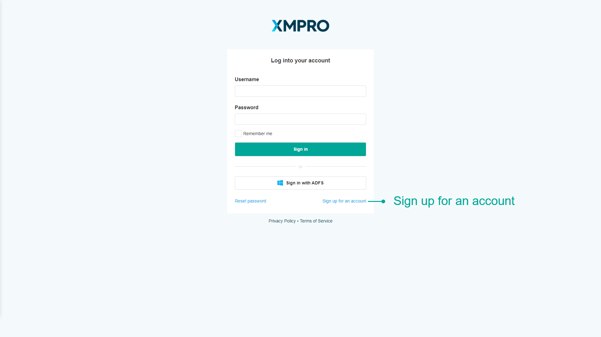

# Create Base Company

## Create a company subscription

1. Browse to the XMPro Subscription Manager website and click on _Sign up for an account_.

2\. Complete the form, checking the _Create new company_ checkbox, and press Agree

.png>)

3\. Browse to the XMPro Subscription Manager website

4\. Log in using the XMPro credentials (admin@xmpro.onxmpro.com)

.png>)


The username and password displayed on the final step of the Subscription Manager deployment.


5\. Open the Companies page from the left-hand menu

6\. Click the Company you have just requested to be added (in this example, "Company")

7\. Click the Subscription Requests button in the command bar, click the request and click Save


The requested Company has been approved and subscribed to XMPro Subscription Manager. The user you applied with above can now log in.


8\. Press Ok

.png>)

## Request a license

Next we add subscriptions for Data Stream Designer and App Designer to the new Company:

1\. Click the Subscriptions gauge in the Company to open the Company's Subscriptions

2\. Click the Add button in the command bar to add a new Subscription

.png>)

3\. Select the Data Stream Designer product


The exact name will depend on your installation, in this example, it is "DataStreams".


4\. Click _Request a new License_


This sends a request to XMPro for a Data Stream Designer license for this Company.


.png>)

5\. Change the Product to App Designer and request another license


Licenses are given on an individual basis by the [XMPro support team](http://xmpro.com/support/).


When you have received a license for each product through an email sent to the email address used to create this account, return to this page.

## Upload the license

1\. Select the Data Stream Designer product, upload its corresponding license and click Save

.png>)

2\. Click Add on the Subscriptions page and repeat the steps above for the App Designer product

.png>)

## Add the user

Now we will add the user to each subscription:

1\. Click the Data Stream Designer product and click the Add button

2\. Select the user, role, any permissions the user should have in the product and click Save

.png>)

3\. Repeat the above steps for the App Designer.
