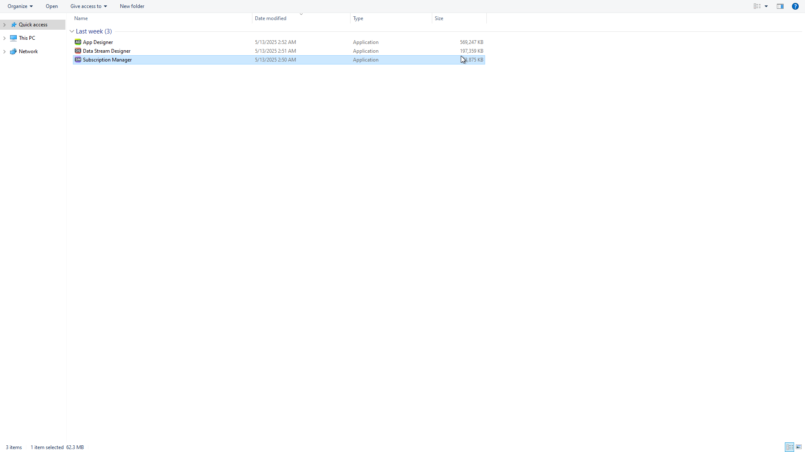
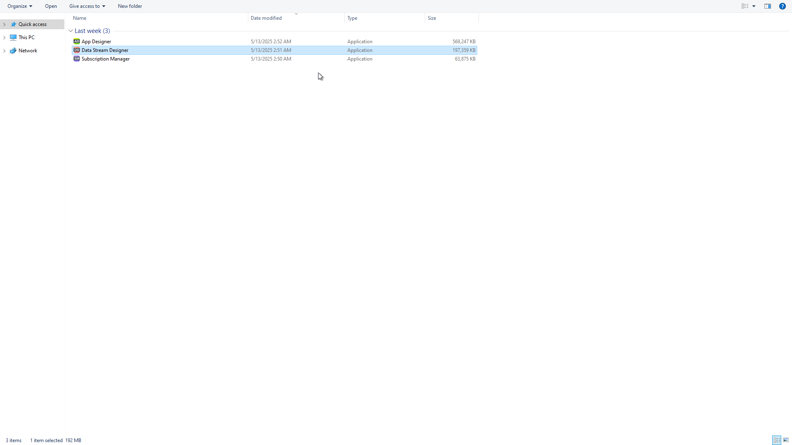
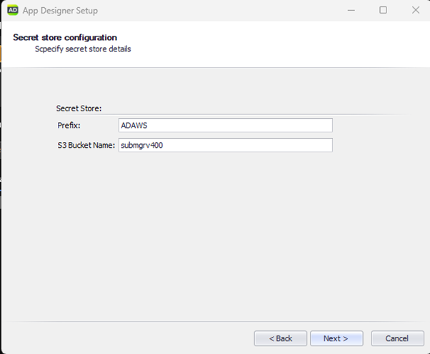
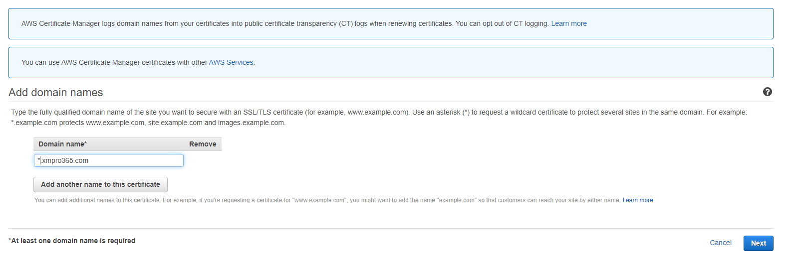
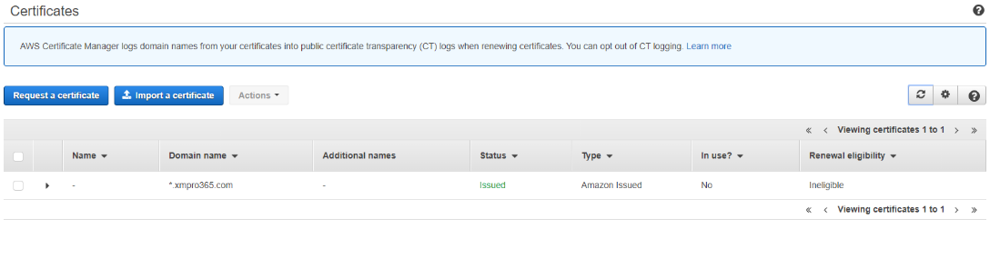
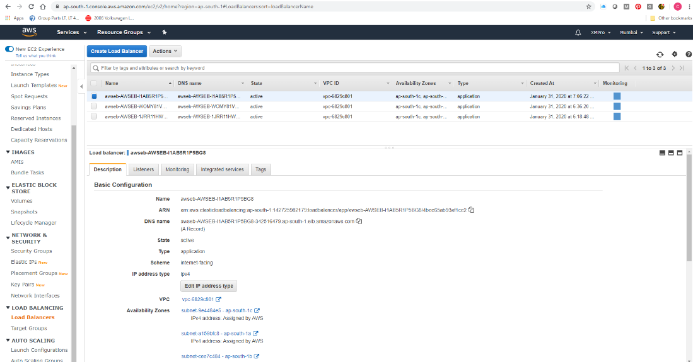
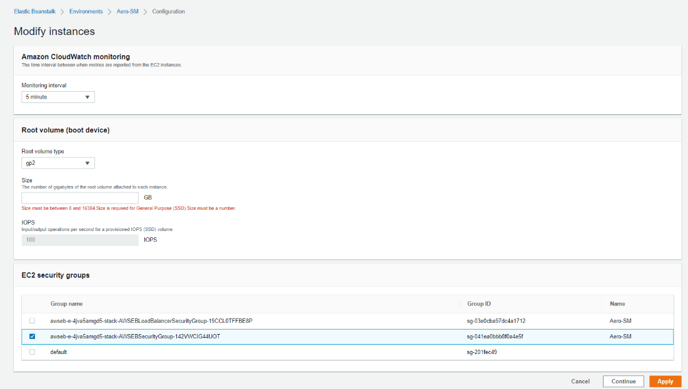
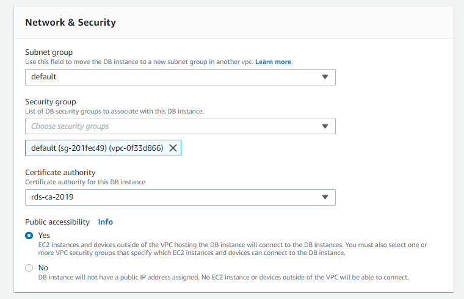
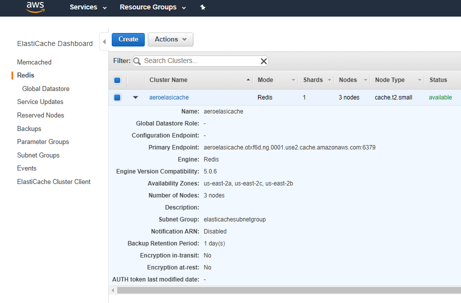

---
layout:
  title:
    visible: true
  description:
    visible: true
  tableOfContents:
    visible: true
  outline:
    visible: true
  pagination:
    visible: false
---

# AWS

## Architecture

The following deployment diagram shows an example architecture and the necessary resources for the XMPro platform in AWS.

<figure><figcaption><p>Fig 1: Example XMPro architecture in AWS</p></figcaption></figure>

The solution is deployed as an auto-scaling Elastic Beanstalk Application with 3 environments:

* SM – Subscription Manager
* AD – Application Designer
* DS – Data Stream Designer & API

These environments use Redis for a centralized Cache and RDS for database storage.

All data transfers are done via HTTPS and the SSL certificates are managed in AWS Certificate Manager.

There are two accounts set up: one for production and one for non-production. Both of these environments follow the above architecture and deployment.

## Prerequisites

In order to proceed with the deployment, you are required to complete the steps in the **1. Preparation** guide:

1. Meet the [**hardware** requirements](../1.-preparation.md#hardware-requirements)
2. Install the [**software** requirements](../1.-preparation.md#software-requirements)
3. Follow the [certificate and communication steps](../1.-preparation.md#preparation-steps)


**Two SSL Certificates are required**

1. An SSL Certificate in AWS Certificate Manager, used by IIS (See the [Appendix](aws.md#ssl-certificate-in-certificate-manager) guide).\\
2. An SSL Certificate, used by the SM instance (added to the [S3 Bucket](aws.md#create-s3-bucket) during the installation).\
   Create or ask your administrator for an SSL certificate with the correct DNS name. A self-signed certificate is good enough. There are many ways to generate this certificate, one of which is described in the above [1. Preparation](../1.-preparation.md#https-ssl-certificate) guide. Please note the file names **must** be called **ssl.pfx** and **ssl.password.txt**.


**Resources**

We are going to be deploying the following resources, please ensure you have the desired domain names ready.

1. SQL RDS
2. Parameter Store
3. Elastic Beanstalk Application
4. Elastic Beanstalk Environment – Subscription Manager
5. Elastic Beanstalk Environment – App Designer
6. Elastic Beanstalk Environment – Data Stream Designer & API

An example of preferred domain names is as follows; each set is for a specific account as per the architecture diagram.

For production:

* https://sm-xmpro․_**domain**_․com
* https://ad-xmpro․_**domain**_․com
* https://ds-xmpro․_**domain**_․com

For non-production:

* https://sm-nonprod-xmpro․_**domain**_․com
* https://ad-nonprod-xmpro․_**domain**_․com
* https://ds-nonprod-xmpro․_**domain**_․com

Log on to the [AWS Management Console](https://console.aws.amazon.com/) and switch to the region you want to deploy the solution in, you will need Administrative rights to the subscription to complete the deployment.

## Install

### ElastiCache

In the **AWS Management Console**, search for **ElastiCache** and navigate to it

1. Click _Create_ (or _Get Started Now_ if visible).
2. Select **Redis**, and click _Create_
3. Configure Redis Cache:
   1. Provide a **name** for the cache.
   2. Select the **node type** based on workload requirements.
   3. Configure **replication** and p**arameter groups** if needed.
   4. Leave other Redis options as defaults unless specific tuning is required.
4. Network Configuration:
   1. Provide **Subnet** details.
   2. Select the VPC where Redis will be deployed.
   3. Ensure **security group settings** allow necessary access.
5. Finalize Creation:
   1. Click _Create_ to deploy the Redis cache
6. Security Group Configuration:
   1. Navigate to **EC2** in AWS Services.
   2. Under **Network & Security**, select **Security Groups**.
   3. Edit the relevant security group and _add inbound rule_ for **Redis Port**
      \
      **6379**.
7. Retrieve Redis Endpoint
   1. Once the cache is created, locate the Redis endpoint.
   2. This will be used later in the Redis Connection String.


Note:

* SignalR Compatibility:
  * Currently, SignalR doesn’t support Redis Clusters ([Microsoft Docs](https://docs.microsoft.com/en-us/aspnet/signalr/overview/performance/scaleout-with-redis))
  * Sticky Sessions must be used for SignalR ([Microsoft Docs](https://learn.microsoft.com/en-us/aspnet/core/signalr/scale?view=aspnetcore-6.0))
* Security Best Practices:
  * Restrict access to Redis only to necessary sources.
  * Consider enabling **TLS encryption** for secure communication.
* Performance Optimization:
  * If scaling is required, consider **Cluster Mode enabled** for Redis ([AWS
    \
    Guide](https://community.aws/content/2sJeZRfAryEvMZK4omV3wzLanR6/setting-up-amazon-elasticache-redis-cluster-using-aws-cdk)).


### Domain name DNS (Route 53/Hosting Zones)

1. Log into Your Domain Registrar
   1. Access the DNS management section for your domain.
2. Create a CNAME Record (For Subdomains)
   1. If you're pointing a subdomain (e.g., app.example.com), create a **CNAME**
      \
      **record**.
   2. Set the **CNAME value** to your ALB’s DNS name (e.g., dualstack.albname.region.elb.amazonaws.com).
3. Create an A Record (For Root Domains, If Supported)
   1. Some registrars allow **A records** to point to AWS ALBs, but many do not.
   2. If supported, create an **A record** and set it to the IP address of your ALB
      \
      (not always recommended due to dynamic IP changes).
4. Update Nameservers (If Needed)
   1. If your registrar requires external DNS management, you may need to
      \
      update nameservers to AWS or another provider.
5. Wait for DNS Propagation
   1. Changes may take a **few minutes to 24 hours** to fully propagate.

#### Considerations

* **CNAME records** work best for ALBs since AWS load balancers don’t have static
  \
  IPs.
* If your registrar doesn’t support **CNAME at the root domain**, you may need a
  \
  third-party DNS provider like Cloudflare or Route 53.

### Amazon RDS Creation

In the **AWS Management Console** navigate to **Aurora and RDS**.

1. In the navigation pane, click **Databases** and then click _Create database._
2. Select _Standard create_, _SQL Server,_ and the desired _Template_ for the database instance.
3. Provide the _DB instance Identifier_, _Username,_ and _Password_ for the RDS database instance
4. Click create.
5. Once created, under Connectivity & Security, take note of the DB Identifier created.


Make a note of the following:

* _Endpoint_ - for example: _aero-sql.cug4m2yk6h94.ap-south-1.rds.amazonaws.com_
* User - as specified earlier
* Password - as specified earlier


6\. The security group will need to be modified to allow inbound traffic this is done as follows:

6.1. Click the _VPC security groups_.

.png>)

6.2. Select the _Default_ security group, click _Inbound_ then click _Edit_.

.png>)

6.3. Add a new rule called **MS SQL**, with _Protocol_ as **TCP** and _Port Range_ as **1433**; and click Save.

.png>)

### Parameter Store Identity and Access

In the **AWS Management Console** navigate to **IAM**.

1. Create a New IAM Policy:
   1. _Click_ **Policies**, then select _Create Policy_.
   2. Select **Import managed policy**.
2. Import a Managed Policy for SSM Access:
   1. Search for **AmazonSSMManagedInstanceCore** and select it.
   2. Click _Import_.
3. Add Additional Permissions for Parameter Store Access:
   1. Click **Add additional permission**.
   2. Choose **Systems Manager** as the service.
   3. Under **Actions**, select the following Read permissions:
      1. ssm:GetParameter
      2. ssm:GetParameters
      3. ssm:GetParametersByPath
   4. If write access is needed, also select ssm:PutParameter.
   5. Click **Review Policy**.
4. Specify Resources to Limit Access Scope:
   1. Expand **Resources**.
   2. Instead of selecting **All Resources**, specify exact **ARNs** for the
      \
      parameters needing access to ensure least privilege.
5. Finalize the Policy Creation:
   1. Enter a **Name** and **Description** for the policy.
   2. Click **Create Policy**.
6. Attach the Policy to the Appropriate Role:
   1. Search for the newly created policy.
   2. Select it and click **Policy Actions**.
   3. Choose **Attach** from the dropdown menu.
   4. Attach the policy to **aws-elasticbeanstalk-service-role** or another
      \
      appropriate IAM role.
   5. Click **Attach Policy**.

By following these refined steps, you ensure that access to AWS Systems Manager
\
Parameter Store is both controlled and optimized while maintaining security best
\
practices.

### Create Elastic Beanstalk Application

The first step in using AWS Elastic Beanstalk is to create an application, which represents your web application in AWS. In Elastic Beanstalk an application serves as a container for the environments that run your web app and for versions of your web app's source code, saved configurations, logs, and other artifacts that you create while using Elastic Beanstalk.

1. Open the **Elastic Beanstalk** console, and then, in the _regions_ drop-down list, select your region.
2. In the navigation pane, choose **Applications**, and then click _Create Application_.
3. Use the on-screen form to provide an _application name_ and click Create.


You have successfully created the application. Next, we'll create the application's environments for each product: Subscription Manager, Data Stream Designer, and App Designer.


## Subscription Manager

### Create Environment

1. Select the Application, click on Actions then click Create environment.
2. Configure environment:
   1. Select _Web server environment_ as the _Environment tier._
   2. Provide the _Environment name_ for Subscription Manager.
   3. Select _.NET on Windows Server_ and select the supported version.
   4. Select _Sample Application_ and under _Presets_, select _Custom configuration._
   5. Click _Next._
3. Configure service access:
   1. Configure and click _Next._
4. Setup networking, database, and tags - optional:
   1. Configure and click _Next._
5. Configure _Instance traffic and scaling:_
   1. For the _Capacity_ section, select **Load Balanced** under Environment Type and set the required Instance Min and Max to **1**. (More information can be found [here](https://docs.aws.amazon.com/autoscaling/ec2/userguide/asg-capacity-limits.html)).
   2. For the _Listener_ Section, add a new listener with the following configure:
      1. Port: 443
      2. Protocol: HTTPS
      3. SSL certificate: Select the SSL certificate you added in the Certificate Manager earlier.
   3. For the _Processes_ Section, select the _default_ Process and under Actions click _Edit_ and update to:&#x20;
      1. Port: 443
      2. Protocol: HTTPS
      3. Health check\Path: /favicon.ico
      4. Sessions\Stickiness policy enabled: True
   4. Click Next
6. Configure updates, monitoring, and logging – optional:
   1. Configure and click _Next._
7. Review:
   1. Review the previous configuration and click _Submit._
8. While the environment is created, take note of the load balancer created in the logs.
   1. e.g Created Load Balancer listener named: \
      arn:aws:elasticloadbalancing:us-west-1:142725982179:listener/app/awseb-- AWSEB-\
      itYC8AXwyswd/a0e5dc6a6ad0a418/fcd8ccc52761bd5d.

### Hosting Zone Configuration

In the AWS Management Console navigate to **Route 53**.

1. In the navigation pane, click **Hosted Zones** and find the one created for SM.
2. Create a new record with the following configuration.
   1. Record name: keep blank
   2. Record type: A – Routes traffic to an IPv4 address and some AWS resources
   3. Alias: True
   4. Route trafic to:
      1. Endpoint: Alias to Application and Classic Load Balancer
      2. Region: _The region of where the Environment was deployed_
         1. _Now_ supply the load balance created when Environment was deployed earlier.

### Create S3 Bucket

#### Create the S3 Bucket

In the **AWS Management Console**, navigate to **S3**

1. Click _**Create Bucket**._
2. Enter a **unique bucket name** and select your **AWS region**.
3. Scroll down to the Block Public Access settings section.
4. _Uncheck_ "Block all public access" (AWS strongly recommends keeping this
   \
   enabled for security reasons).
5. Click **Create bucket**.

#### Configure Public Access

1. Open your **newly created bucket**.
   \
   2\. Go to the **Permissions** tab.
   \
   3\. Under **Bucket policy**, click **Edit** and enter this policy:
   1. replace _your-bucket-name_ with your actual bucket name.

```json
{
    "Version": "2012-10-17", 
    "Statement": [
        {
            "Sid": "PublicReadGetObject",
            "Effect": "Allow",
            "Principal": "*",
            "Action": "s3:GetObject",
            "Resource": "arn:aws:s3:::your-bucket-name/*"
        }
    ]
}
```

2. Click **Save changes**.

#### &#x20;Set Public Object Permissions

1. Navigate to the **Objects** tab inside your bucket.
2. Upload a file and select it.
3. Click **Permissions** and set **Public access**.
4. Confirm changes.

**Security Considerations**

* AWS strongly discourages making entire buckets publicly accessible due to
  \
  security risks.


The signing certificate is between the end user and the load balancer. The instance SSL certificate is used between the instances and the load balancer.


### Install Subscription Manager

1.  Run the installation wizard for Subscription Manager.\
    \


    <figure><figcaption></figcaption></figure>
2. Run the Subscription Manager installer as Administrator.

.png>)

3. Follow the instruction in the installation wizard: click _Next_.

.png>)

4. Select the Install option (1) and click _Next_ (2).

.png>)

5. Tick Database (1), Web Application (2), select AWS Package (3), and click Next (4).

.png>)

6. Enter the secret store prefix (1), the S3 Bucket name from earlier (2), and click Next (3).

.png>)

7. Provide the Database connection details noted in the database creation steps:
   1. Provide the SQL endpoint (1)
   2. Change the SQL user to SQL Authentication and provide credentials (2)
   3. Optional: provide a new DB name or use the one provided (3)

<figure><figcaption></figcaption></figure>

7. Select the installation path (1), the DNS name for the site (2), and click Next (3).

.png>)

9. Enter the SMTP details referenced in the [1. Preparation](../1.-preparation.md#smtp-account) guide and click Test SMTP settings (1), If successful, click Next (2).

.png>)

10. Enter the Signing Certificate details:

    1. Browse to the certificate created earlier
    2. Enter the certificate password
    3. Select the subject name
    4. Select Local Machine
    5. Click Next&#x20;

    
11. Enter the Encryption Certificate details

    1. Browse to the certificate created earlier
    2. Enter the certificate password
    3. Select the subject name
    4. Select Local Machine
    5. Click Next

    <figure><figcaption></figcaption></figure>
12. Click Next once the installation has completed.

.png>)

13. Make a note of the Username and password, and click Finish.

.png>)

### Parameter Store Configuration

In the AWS Management Console navigate to **AWS Systems Manager**

1. In the navigation pane, click _Parameter Store_, under _Application Tools_
2. Click **Create parameter**
3. Provide the name found in the **App Secrets.xml** file in the **SM AWS Package** previously created
4. Set the Type as a SecureString
5. For the value, provide the one found in **App Secrets.xml**
6. Click _Create Parameter_
7. Repeat for all values in the file

### Preparing SSL Certificate Files for S3 Deployment

1. Browse to the folder where SM was installed.
2. Find the S3 Deployment Folder inside SM.
3. Duplicate the Certificate Files
   1. Make a copy of the `sign.pfx` file and rename it to `ssl.pfx`.
   2. Make a copy of the `sign.password.txt` file and rename it to `ssl.password.txt`.
4. Upload both `ssl.pfx` and `ssl.password.txt` to the S3 bucket you created earlier.

### Deploy the Subscription Manager

Navigate back to **Elastic Beanstalk** and open the **Environment** page

1. Click and navigate to the SM Environment you created earlier
2. Click _Upload and deploy_&#x20;
3. Use the on-screen form to upload the zip file found in the **SM AWS Package**.
4. Update the Version label if needed and click **Deploy**
5. Navigate to the URL and log in using the following credentials:
   1. admin@xmpro․onxmpro․com
   2. Pass@word1

.png>)

6\. Reset the administrator password and store it securely in a password vault.

7\. Click SM.

<figure><figcaption></figcaption></figure>

8\. Click Products in the menu and click the Installation Profile button

<figure><figcaption></figcaption></figure>

9. Enter a File Key and press OK to download the file

<figure><figcaption></figcaption></figure>

## Data Stream Designer

### Create Environment

In the AWS Management Console, navigate to **Elastic Beanstalk**.

1. In the navigation pane, choose _Applications_
2. Select the previously created application, expand _Actions_ and choose _Create environment._
3. Follow the same instructions on environment creation as done for the Subscription Manager.
   1. Including the [#hosting-zone-configuration](aws.md#hosting-zone-configuration "mention") section after the **Load Balancer** is created

### Install  Data Stream Designer

1.  Run the installation wizard for Data Stream Designer.\
    \


    <figure><figcaption></figcaption></figure>
2.  Run the Data Stream Designer installer as Administrator.&#x20;

    .png>)
3.  Follow the instruction in the installation wizard: click _Next_.&#x20;

    .png>)
4. Select Install (1) and click Next (2).

.png>)

3. Select the items as shown below and click Next.

.png>)

4. Provide a Prefix and the S3 Bucket name

.png>)

5. Provide the Database Details noted in the database creation steps:
   1. Provide the SQL endpoint
   2. Change the SQL user to SQL Authentication and provide credentials
   3. Optional: provide a new DB name or use the one provided

.png>)

6. Select the installation path (1), the DNS name for the site (2), and click Next (3).

.png>)

7. Browse to the downloaded installation profile and select it

.png>)

8. Login using the credentials for SM

.png>)

9. Click Next

.png>)

10. Once the installation completes, click Next

.png>)

11. Click Finish

.png>)

### Deploy Data Stream Designer

1. Repeat same steps as SM for the [Parameter Store Configuration](aws.md#parameter-store-configuration)
2. Repeat steps 1 - 4 as SM for [Deploy the Subscription Manager](aws.md#deploy-the-subscription-manager)

## App Designer

### Create Environment

In the AWS Management Console, navigate to **Elastic Beanstalk.**

1. In the navigation pane, choose _Applications_
2. Select the previously created application, expand Actions and choose Create environment.
3. Follow the same instructions on environment creation as done for the Subscription Manager.
   1. Including the [#hosting-zone-configuration](aws.md#hosting-zone-configuration "mention") section after the **Load Balancer** is created

### Install App Designer

1.  Run the installation wizard for App Designer.\
    \


    <figure><figcaption></figcaption></figure>
2.  Run the App Designer installer as Administrator. \


    .png>)
3. Follow the instruction in the installation wizard: click _Next_.

.png>)

2.  Select Install and click Next.\


    <figure><figcaption></figcaption></figure>
3. Select the items as below and click Next.

.png>)

4. Provide a Prefix and the S3 Bucket name

<figure><figcaption></figcaption></figure>

4. Provide the Database connection details noted in the database creation steps:
   1. Provide the SQL endpoint
   2. Change the SQL user to SQL Authentication and provide credentials
   3. Optional: provide a new DB name or use the one provided

 (2).png>)

6. Select the installation path (1), the DNS name for the site (2), and click Next (3).

.png>)

7. Provide the URL for the Data Stream Designer installed earlier, and click Next.

.png>)

8. Enter the SMTP details referenced in the [1. Preparation](../1.-preparation.md#smtp-account) guide and click Next.

.png>)

9. Enter the Twilio details referenced in the [1. Preparation](../1.-preparation.md#twilio-optional) guide and click Next. If you don't want SMS notifications you can select "None" from the "Select Provider" dropdown.

.png>)

10. Browse to the downloaded installation profile and select it. Click Next.

.png>)

11. Login with SM credentials to authenticate.

.png>)

12. Click Next.

.png>)

13. Click Next after the installation is complete.

.png>)

14. Click Finish.

.png>)

### Deploy App Designer

1. Repeat same steps as SM for the [Parameter Store Configuration](aws.md#parameter-store-configuration)
2. Repeat steps 1 - 4 as SM for [Deploy the Subscription Manager](aws.md#deploy-the-subscription-manager)

_See troubleshooting if failed deployment_

#### Troubleshooting

If the zip file created exceeds AWS 500mb upload limit, then the following steps can be taken:

1. Open the unzipped file of the AWS Package
2. Navigate to the following path, Package\ClientApp\dist
3. Delete additional language packs that are not required.
4. Navigate back to within the Package folder
5. Select all files within the folder and create a new Package.zip
6. Confirm size is less than the limit and redeploy with the new zip.

## Upgrade

The following steps relate to upgrading an existing AWS deployment

### Uninstall Existing Wizards

This only applies if the machine used to generate the AWS package has older versions of the wizard installed.

1. From the start menu select one of the XMPro Products and right-click it.
2. Click Uninstall.
3. Select XMPro Subscription Manager from the list of programs displayed.
4. Click Uninstall.
5. When prompted to confirm uninstall click Yes.
6.  Click Next\
    \


    <figure><figcaption></figcaption></figure>
7.  When prompted to select the install to modify click Cancel. \
    **We do not want to remove the installed XMPro site, only the installer.**\
    \


    <figure><figcaption></figcaption></figure>
8. Repeat for all the installers.

### Create a Snapshot

In AWS Console navigate to **Aurora and RDS**

1. In the navigation pane, click _Databases_
2. Select the existing instance, expand _Actions_ and click _Take snapshot_
3. Provide a _Snapshot name_ and click _Take snapshot._

### Subscription Manager

#### AWS Package Creation

1.  Run the installation wizard for Subscription Manager.\
    \


    <figure><figcaption></figcaption></figure>
2.  Run Subscription manager as Administrator. \


    .png>)
3.  Follow the instruction in the installation wizard: click Next. \


    .png>)
4. Select the Install option (1) and click Next (2).
   1.  _**Do not select Upgrade**_ \


       .png>)
5.  Tick Web Application(1), select AWS Package (2), and click Next (3)

    1. _**Exclude the Database component**_  \


    <figure><figcaption></figcaption></figure>
6.  Enter the secret store prefix (1), the S3 Bucket name from earlier (2), and click Next (3) \


    .png>)
7.  Provide the Database connection details noted in the database creation steps:

    1. Provide the SQL endpoint (1)
    2. Change the SQL user to SQL Authentication and provide credentials (2)
    3. Select existing SM database created earlier (3)
    4. Click Next (4)\


    <figure><figcaption></figcaption></figure>
8.  Select the installation path (1), the DNS name for the site (2), and click Next (3). \


    .png>)
9.  Enter the SMTP details referenced in the [1. Preparation](../1.-preparation.md#smtp-account) guide and click Test SMTP settings (1), If successful, click Next (2). \


    .png>)
10. Enter the Signing Certificate details:

    1. Browse to the certificate created earlier
    2. Enter the certificate password
    3. Select the subject name
    4. Select Local Machine
    5. Click Next \


    <figure><figcaption></figcaption></figure>
11. Enter the Encryption Certificate details

    1. Browse to the certificate created earlier
    2. Enter the certificate password
    3. Select the subject name
    4. Select Local Machine
    5. Click Next\


    <figure><figcaption></figcaption></figure>
12. Click Next once the installation has completed. \


    .png>)
13. Click Finish \


    .png>)

#### Deploy Subscription Manager

Navigate back to **Elastic Beanstalk** and open the **Environment** page

1. Click and navigate to the SM Environment you created earlier
2. Click _Upload and deploy_&#x20;
3. Use the on-screen form to upload the zip file found in the **SM AWS Package**.
4. Update the Version label if needed and click **Deploy**

#### Troubleshooting

If deployment fails due to locked SM log files, follow these steps:

1. Open the configuration of the Subscription Manager environment
2. Click and navigate to _Service access_.
3. Add **EC2 key pair** and click _Apply_
4. Wait for the environment to complete auto-healing - the load balancer will automatically start a new app service.
5. In AWS Console, navigate to **EC2** and click _Instances_ in the navigation pane
6. Observe the Environment may appear twice, select the one with a _Running_ for its _Instance state_.
   1. as mentioned in Step 4, the duplicate is because of the termination.
7. Click the RDP client tab and click _Download remote desktop file_
8. Now click _Get password_
9. On the _Get Windows password_ page
   1. Upload a private key file paired with that EC2 Key pair
   2. Click _Decrypt password_
10. Now copy the now visible password, where _Get password_ was previously
11. Connect to the service using the downloaded RDP file
12. Open IIS, and click _Stop_ on the server level
13. Repeat Deployment steps (IIS will restart after deployment)

### Data Stream Designer

#### AWS Package Creation

1.  Run the installation wizard for Data Stream Designer.\


    <figure><figcaption></figcaption></figure>
2.  Run Data Stream Designer as Administrator.\


    .png>)
3.  Follow the instruction in the installation wizard: click Next.  \


    .png>)
4.  Select the Install option (1) and click Next (2).

    1. _**Do not select Upgrade**_\


    .png>)
5.  Tick Web Application(1), select AWS Package (2), and click Next (3)

    1. _**Exclude the Database component**_&#x20;
    2. Also, Leave Configure Subscription Manager&#x20;

    <figure><figcaption></figcaption></figure>
6.  Enter the secret store prefix (1), the S3 Bucket name from earlier (2), and click Next (3).  \


    .png>)
7.  Select the installation path (1), the DNS name for the site (2), and click Next (3). \


    <figure><figcaption></figcaption></figure>
8.  Click Next once the installation has completed. \


    .png>)
9.  Click Finish \


    <figure><figcaption></figcaption></figure>

#### Deploy Data Stream Designer

Navigate back to **Elastic Beanstalk** and open the **Environment** page

1. Click and navigate to the DS Environment you created earlier
2. Click _Upload and deploy_&#x20;
3. Use the on-screen form to upload the zip file found in the **DS AWS Package**.
4. Update the Version label if needed and click **Deploy**

### App Designer

#### AWS Package Creation

1.  Run the installation wizard for App Designer.\
    \


    <figure><figcaption></figcaption></figure>
2.  Run the App Designer installer as Administrator. \


    .png>)
3.  Follow the instruction in the installation wizard: click Next.\


    .png>)
4. Select the Install option (1) and click Next (2).
   1.  _**Do not select Upgrade**_\


       <figure><figcaption></figcaption></figure>
5.  Tick Web Application(1), select AWS Package (2), and click Next (3)

    1. _**Exclude the Database component and**_**&#x20;Configure Subscription Manager**

    <figure><figcaption></figcaption></figure>
6.  Enter the secret store prefix (1), the S3 Bucket name from earlier (2), and click Next (3).\


    <figure><figcaption></figcaption></figure>
7.  Select the installation path (1), the DNS name for the site (2), and click Next (3).\


    
8.  Enter the SMTP details referenced in the [1. Preparation](../1.-preparation.md#smtp-account) guide and click Test SMTP settings (1), If successful, click Next (2).\


    .png>)
9.  Enter the Twilio details referenced in the [1. Preparation](../1.-preparation.md#twilio-optional) guide and click Next. If you don't want SMS notifications you can select "None" from the "Select Provider" dropdown.\


    .png>)
10. Click Next once the installation has completed.\


    .png>)
11. Click Finish.\


<figure><figcaption></figcaption></figure>

#### Deploy App Designer

Navigate back to **Elastic Beanstalk** and open the **Environment** page

1. Click and navigate to the AD Environment you created earlier
2. Click _Upload and deploy_&#x20;
3. Use the on-screen form to upload the zip file found in the **AD AWS Package**.
4. Update the Version label if needed and click **Deploy**

[#troubleshooting](aws.md#troubleshooting "mention")

## Appendix

### SSL certificate in Certificate Manager

In the AWS console go to the Certificate Manager

* Select the region the SSL Certificate is required in
* The certificate can be either imported or a new certificate can be requested.

#### To request a new certificate

 (1).png>)

1. Click _**Get started**_ under Provision Certificate

 (1).png>)

2\. Click _**Request a certificate**_



3\. Enter the certificate domain name and click _**Next**_


4\. Select the DNS validation method and click _**Next**_

.png>)

5\. Review your settings and click _**Confirm and request**_ if correct

.png>)

6\. Once the DNS configuration file becomes available, click _**Continue**_

.png>)

7\. Contact your IT administrator to complete the DNS verification by adding the CNAME record to your website DNS



8\. Once the DNS verification is complete the SSL certificate is added to your certificate manager for the specified region

#### To import a certificate

.png>)

1. Click _**Get started**_ under Provision Certificate

.png>)

2\. Click _**Import a certificate**_


3\. Complete the certificate detail and click _**Next**_ to import the certificate

### Create the EB Application URLs

1. Search for **ElastiCache** in the _**Services**_ dropdown and select it.


2\. In the left-hand panel, click _Hosted Zones._


3\. Click _Create Hosted Zone._

.png>)

1. In the right-hand panel complete the _Domain Name_ using the domain name you created the SSL certificate for and click _Create_.

.png>)

5\. Click _Create Record Set._


6\. Change _Alias_ to _**Yes**_, then go to EC2 in AWS services and scroll down to Load Balancing and click Load Balancers.



7\. Select a Load Balancer and click _Tags_ to identify what Application is serviced by the selected Load Balancer.


8\. When the correct Load Balancer for the Application is identified, click the _Description_ Tab.

.png>)

9\. Copy the _DNS Name_ for the Load Balancer. Go back to the Record Set you created in Route 53.

.png>)

10\. Paste the Load Balancer DNS address in the Alias Target field and click Create.

This needs to be completed for each ELB Application.

.png>)

11\. The NS values must be provided to you by the DNS Administrator to create the NS records in the Domain DNS records. This needs to be completed for each ELB Application.

### Configure the security groups

1. In the AWS Management Console, choose **EC2** under _Compute_ in the _**Services**_ drop-down.
2. Click _Security Groups_ under the NETWORK & SECURITY option.

.png>)

3\. Click _Create security group._

.png>)

4\. Create the _**RDS\_security\_group**_ and select the _VPC_.

.png>)

5\. Add the following rules and replace the source with the security groups assigned to the environments you created earlier.

6\. Create an additional security group called _**REDIS\_Cache\_security\_group.**_

.png>)

7\. Add these rules again using the security groups for the environments created earlier as the source.

.png>)

8\. In Elastic Beanstalk, select the environment you want to change.

.png>)

9\. Click Configuration in the left pane



10\. Remove the _default_ security group and click _Apply._ Do this for all the environments.


11\. In Services, selects _**RDS**_ and click _Databases._

.png>)

12\. Select your RDS database and click _Modify._



13\. Scroll down to _Network and Security_. Select the RDS security group you created earlier and remove the _default_ security group.


14\. Scroll down and click _Continue._

.png>)

15\. Select _**Apply Immediately**_ and click _Modify DB Instance._

.png>)

16\. Select _**ElastCache**_ from _Services_ and click **Redis.**



17\. Select the Redis Cache you created earlier and from _Actions_ click _**Modify.**_


18\. Edit the Security Groups

.png>)

19\. Remove the default security groups and add the Redis Cache security group created earlier. Click save and modify.

## Next Step: Complete Installation

The installation of the XMPro Platform is now complete, but there are some environment setup steps before you can use the platform. Please click the below link for further instructions:


[3.-complete-installation](../3.-complete-installation)

